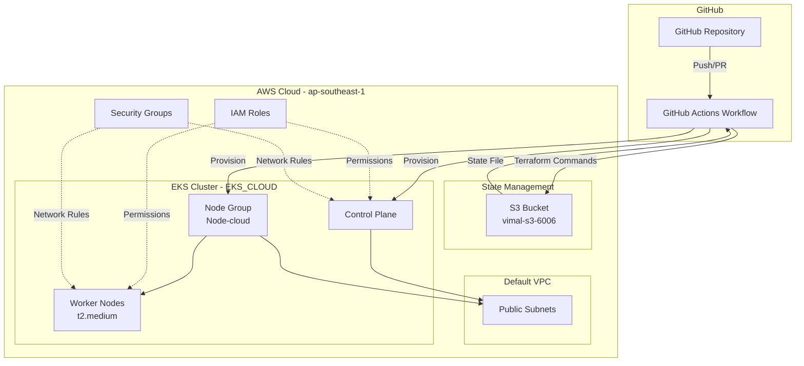
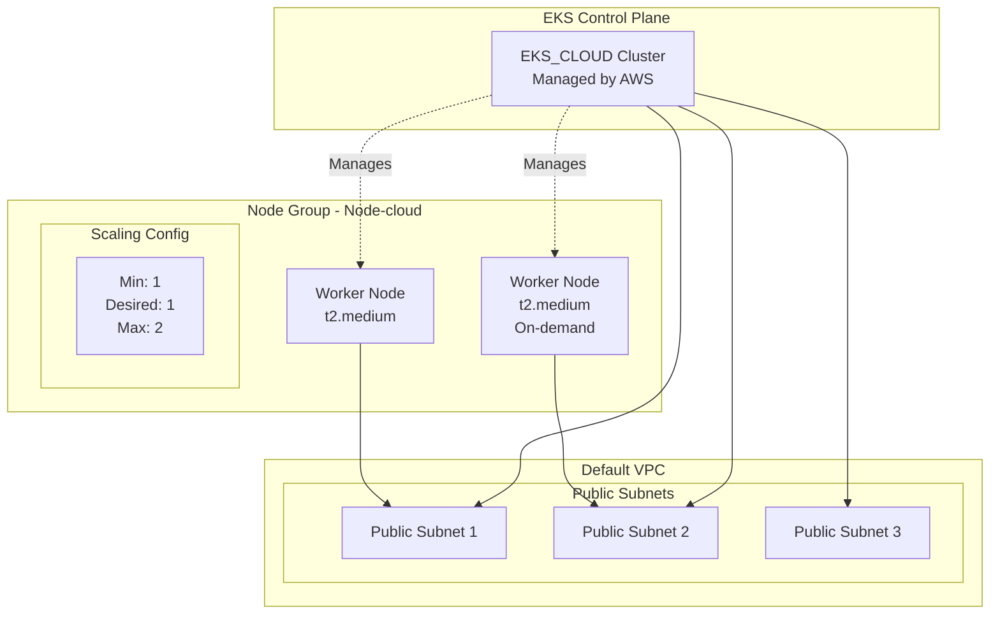
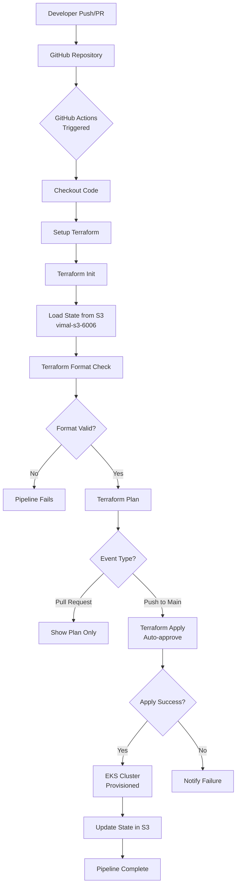
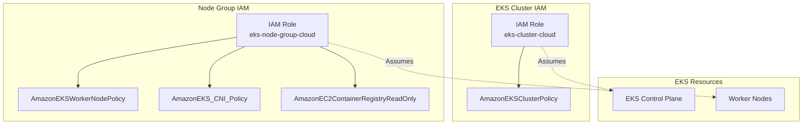

# Terraform EKS Infrastructure with GitOps

## Project Overview

This project provides an Infrastructure as Code (IaC) solution for provisioning an Amazon EKS (Elastic Kubernetes Service) cluster on AWS using the default VPC and existing subnets. The infrastructure is deployed using Terraform and automated through GitHub Actions CI/CD pipeline following GitOps principles, with state management in S3.

## Architecture

### High-Level Architecture



### Infrastructure Architecture



### CI/CD Pipeline Architecture



### IAM Roles and Policies



## Technology Stack

- **Infrastructure as Code**: Terraform 5.0+
- **Cloud Provider**: Amazon Web Services (AWS)
- **Region**: ap-southeast-1 (Singapore)
- **Container Orchestration**: Amazon EKS
- **CI/CD**: GitHub Actions
- **State Management**: S3 Backend
- **Version Control**: Git/GitHub

## Prerequisites

- AWS Account with appropriate permissions
- Terraform >= 5.0
- AWS CLI configured
- kubectl installed
- GitHub account with repository access
- S3 bucket for state management (vimal-s3-6006)

## Repository Structure

```
terraform-EKS/
├── .github/
│   └── workflows/
│       └── eks.yml           # GitHub Actions workflow
├── eks/
│   ├── backend.tf            # S3 backend configuration
│   ├── main.tf               # Main infrastructure code
│   └── provider.tf           # AWS provider configuration
└── README.md                 # Project documentation
```

## Key Features

### Infrastructure Components

1. **EKS Cluster Configuration**
   - Cluster Name: EKS_CLOUD
   - Utilizes default VPC
   - Deployed across multiple public subnets
   - Managed control plane by AWS

2. **Node Group**
   - Name: Node-cloud
   - Instance Type: t2.medium
   - Scaling Configuration:
     - Minimum Size: 1
     - Desired Size: 1
     - Maximum Size: 2
   - Auto-scaling enabled

3. **IAM Roles and Policies**
   - **Cluster Role** (eks-cluster-cloud):
     - AmazonEKSClusterPolicy
   - **Node Group Role** (eks-node-group-cloud):
     - AmazonEKSWorkerNodePolicy
     - AmazonEKS_CNI_Policy
     - AmazonEC2ContainerRegistryReadOnly

4. **State Management**
   - Remote state stored in S3
   - Bucket: vimal-s3-6006
   - State file path: EKS/terraform.tfstate
   - Region: ap-southeast-1

5. **Security Features**
   - IAM role-based access control
   - Least privilege principle applied
   - Dependency management for proper resource creation/deletion
   - Security groups managed by EKS

## GitHub Actions Pipeline

The CI/CD pipeline automates infrastructure deployment with the following workflow:

### Workflow Configuration

**Trigger Events:**
- Push to main branch
- Pull requests to any branch

**Environment:** Production

**Runner:** ubuntu-latest

### Pipeline Stages

1. **Checkout**
   - Clones repository code to runner

2. **Setup Terraform**
   - Installs latest Terraform CLI
   - Configures Terraform Cloud credentials

3. **Terraform Init**
   - Initializes Terraform working directory
   - Downloads required providers
   - Configures S3 backend

4. **Terraform Format Check**
   - Validates code formatting
   - Ensures canonical format compliance

5. **Terraform Plan**
   - Generates execution plan
   - Shows proposed infrastructure changes
   - Runs on all events

6. **Terraform Apply** (Main branch only)
   - Automatically applies changes
   - Provisions/updates EKS infrastructure
   - Runs only on push to main branch

## Setup Instructions

### 1. Clone Repository

```bash
git clone https://github.com/pravindev666/terraform-EKS.git
cd terraform-EKS
```

### 2. Configure AWS Credentials

Set up GitHub Secrets in your repository:
- `TF_API_TOKEN` - Terraform Cloud API token
- AWS credentials (if not using Terraform Cloud)

### 3. Verify S3 Backend

Ensure S3 bucket exists:
```bash
aws s3 ls s3://vimal-s3-6006/
```

If bucket doesn't exist, create it:
```bash
aws s3 mb s3://vimal-s3-6006 --region ap-southeast-1
```

### 4. Initialize Terraform Locally (Optional)

```bash
cd eks
terraform init
terraform plan
```

### 5. Deploy Infrastructure

#### Option A: Via GitHub Actions (Recommended)
Push changes to the main branch to trigger automatic deployment:

```bash
git add .
git commit -m "Deploy EKS cluster"
git push origin main
```

#### Option B: Manual Deployment
```bash
cd eks
terraform init
terraform plan
terraform apply
```

### 6. Configure kubectl

After successful deployment:

```bash
aws eks update-kubeconfig --region ap-southeast-1 --name EKS_CLOUD
kubectl get nodes
kubectl get pods -A
```

## Infrastructure Details

### EKS Cluster Specifications

- **Cluster Name**: EKS_CLOUD
- **Region**: ap-southeast-1 (Singapore)
- **Kubernetes Version**: Latest supported by AWS
- **Networking**: Default VPC with public subnets
- **Node Group**: Node-cloud
- **Instance Type**: t2.medium
- **Capacity**: 1-2 nodes (auto-scaling)

### Resource Naming Convention

- Cluster IAM Role: eks-cluster-cloud
- Node Group IAM Role: eks-node-group-cloud
- Node Group Name: Node-cloud
- Cluster Name: EKS_CLOUD

### Subnet Configuration

The cluster uses the default VPC's public subnets automatically discovered via:
```hcl
data "aws_vpc" "default" {
  default = true
}

data "aws_subnets" "public" {
  filter {
    name   = "vpc-id"
    values = [data.aws_vpc.default.id]
  }
}
```

## State Management

### S3 Backend Configuration

```hcl
terraform {
  backend "s3" {
    bucket = "vimal-s3-6006"
    key    = "EKS/terraform.tfstate"
    region = "ap-southeast-1"
  }
}
```

### State File Access

View current state:
```bash
aws s3 cp s3://vimal-s3-6006/EKS/terraform.tfstate - | jq
```

## Security Considerations

1. **IAM Roles**: Separate roles for cluster and node groups with minimal required permissions
2. **Default VPC**: Uses existing default VPC and public subnets
3. **Dependency Management**: Proper dependency chains ensure correct resource creation/deletion order
4. **State Security**: Remote state stored in S3 with appropriate access controls
5. **API Access**: Cluster API endpoint accessible via IAM authentication

## Cost Optimization

- **Instance Type**: t2.medium provides balance between cost and performance
- **Auto-scaling**: Scales down to 1 node during low usage (minimum)
- **On-demand Instances**: Reliable but consider spot instances for non-production
- **Default VPC**: No additional VPC costs
- **Estimated Monthly Cost**: ~$70-140 USD (varies with usage)

## Troubleshooting

### Common Issues

**Issue**: Terraform state lock error
```bash
# Check S3 for lock file
aws s3 ls s3://vimal-s3-6006/EKS/
```

**Issue**: GitHub Actions failing on format check
```bash
# Format code locally
cd eks
terraform fmt
git add .
git commit -m "Format terraform code"
git push
```

**Issue**: Unable to connect to cluster
```bash
# Update kubeconfig
aws eks update-kubeconfig --name EKS_CLOUD --region ap-southeast-1

# Verify connectivity
kubectl cluster-info
kubectl get svc
```

**Issue**: Node group not scaling
```bash
# Check node group status
aws eks describe-nodegroup \
  --cluster-name EKS_CLOUD \
  --nodegroup-name Node-cloud \
  --region ap-southeast-1
```

**Issue**: IAM permissions error
- Verify IAM roles exist: eks-cluster-cloud, eks-node-group-cloud
- Check policy attachments are complete
- Ensure dependencies are properly configured

## Maintenance Operations

### Scaling Node Group

Edit `main.tf` scaling configuration:
```hcl
scaling_config {
  desired_size = 2  # Change this value
  max_size     = 3
  min_size     = 1
}
```

Commit and push to trigger deployment:
```bash
git add eks/main.tf
git commit -m "Scale node group to 2 nodes"
git push origin main
```

### Changing Instance Type

Modify `instance_types` in `main.tf`:
```hcl
instance_types = ["t3.medium"]  # Upgrade to t3
```

### Upgrading EKS Version

Check available versions:
```bash
aws eks describe-addon-versions --region ap-southeast-1
```

Note: Add version specification to `aws_eks_cluster` resource if needed.

### Destroying Infrastructure

**Warning**: This will delete all resources.

```bash
cd eks
terraform destroy
```

Or trigger via GitHub Actions by modifying workflow.

## Monitoring and Logging

### Cluster Monitoring

```bash
# Check cluster status
aws eks describe-cluster --name EKS_CLOUD --region ap-southeast-1

# View node status
kubectl get nodes -o wide

# Check pod health
kubectl get pods -A
```

### CloudWatch Integration

Enable CloudWatch Container Insights:
```bash
aws eks update-cluster-config \
  --region ap-southeast-1 \
  --name EKS_CLOUD \
  --logging '{"clusterLogging":[{"types":["api","audit","authenticator","controllerManager","scheduler"],"enabled":true}]}'
```

## Verification Steps

After deployment, verify:

1. **Cluster Status**
```bash
aws eks describe-cluster --name EKS_CLOUD --region ap-southeast-1 --query 'cluster.status'
```

2. **Node Group Health**
```bash
kubectl get nodes
```

3. **System Pods**
```bash
kubectl get pods -n kube-system
```

4. **Cluster Info**
```bash
kubectl cluster-info
```

## Project Outcomes

This project demonstrates:
- Infrastructure as Code using Terraform
- AWS EKS cluster provisioning and management
- GitOps workflow with GitHub Actions
- Remote state management with S3 backend
- IAM role and policy management
- Auto-scaling configuration
- CI/CD pipeline automation
- Cloud infrastructure best practices

## Key Skills Demonstrated

- Terraform configuration and state management
- AWS services (EKS, IAM, VPC, EC2)
- Kubernetes cluster setup
- GitHub Actions workflow development
- Infrastructure automation
- Security and access control
- Cloud cost optimization

## Future Enhancements

- Implement custom VPC with private subnets
- Add cluster autoscaler
- Configure Helm for application deployment
- Implement monitoring with Prometheus/Grafana
- Add cost allocation tags
- Implement blue-green deployment strategy
- Add security scanning in CI/CD pipeline


## Contact

For questions or issues, please open an issue in the GitHub repository.
